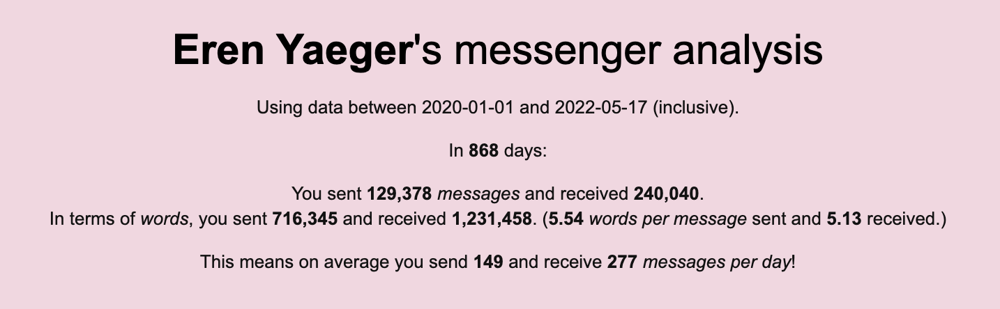
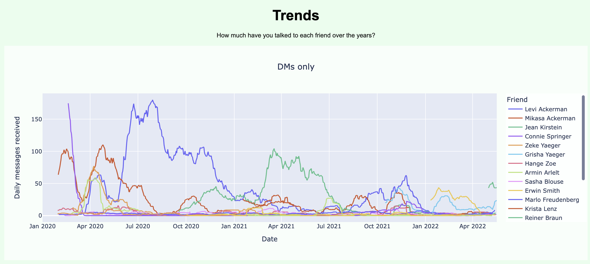
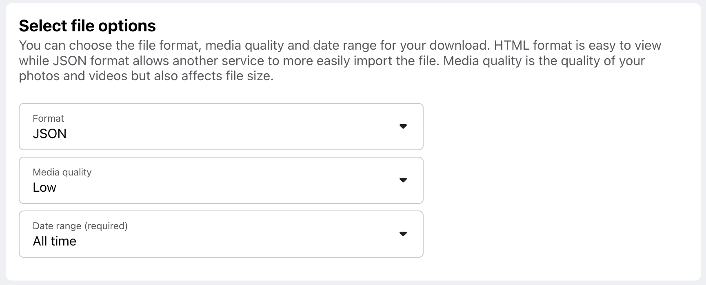
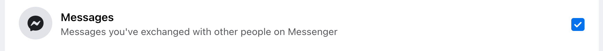
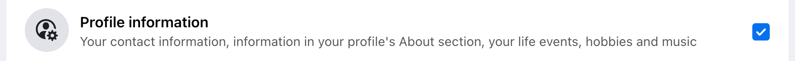
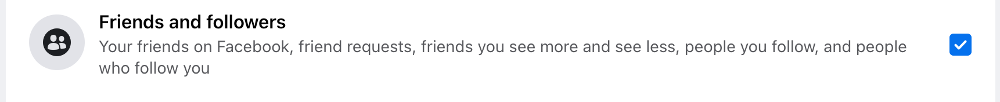

## Messenger Analyse

The goal of this simple package is to help you better understand your Facebook Messenger data. It will answer questions such as:
- How has my Messenger use changed over time?
- Who have I talked to most over the last few years?
- What are my favourite emojis?
- What hours of the day and week am I most active?

It does this by reading in your Messenger data locally and produces a `html` file, allowing you to explore your data. To see what the analysis file will look like, see [here](https://github.com/aoshenz/messenger_analyse/blob/master/example/output_example.html) for an example. Below are some snippets from this file.

<div align="center">


</div>

## How to set up

1. Go to your Facebook [settings](https://www.facebook.com/dyi/?referrer=yfi_settings) > 'Your Facebook Information' > 'Download Your Information' and at a minimum you need to choose these options:
    - File optins in JSON format
    - All time date range
    - Check the boxes for 'Messages', 'Profile information' and 'Friends and followers'

    It takes up to a few days for Facebook to gather this information before you can download it.
<div align="center">




</div>


2. Meanwhile, clone this repository.
`Insert instructions here`
3. Within 'messenger_analyse', create a folder called 'personal_data'. Your Facebook data should be in a `.zip` file. Unzip that file here. So your folder structure should look like: 
messenger_analyse (this repo) > personal_data (folder you created) > facebook-your_name (unzipped facebook folders).
4. Create a virtual environment (optional) and install packages from `requirements.txt`.
5. In `config.py`, you can adjust parameters such as which time period of data to use, your local timezone (default: Sydney), moving average days and so on.


## How to use
After you have completed the steps above, you are now ready to run this script.
### Run from terminal
1. Change directory to this cloned repo.
2. Run `python3 main.py`.

For example:
```
(venv) ➜  messenger_analyse git:(master) python3 main.py
```

### Run from notebook
The `Messenger` class contains methods and attributes allowing you to do further exploration. The code below is an example of some useful attributes to help you get started.
```python
from messenger import Messenger

msg = Messenger()
msg.analyse()

# Data
msg.data_all # data before adjustments
msg.data_adj # data after adjustments based settings chosen in config.py

# Metrics
msg.report_details # configurations
msg.overview_metrics # data metrics

# Charts
msg.timeseries_all # all time chart
```


## Future improvements
Here's a list of ideas that I considered during the project but have not implemented.
### Data
- Emoji clouds
- Sentimentality
    - Mood by time of the day
- Closeness between friends
    - Median time between messages
    - Number of group chats shared with each person
- Samples
    - First message to a friend
- Net friends over time
- Calls
- External data
    - Weather
- Group chats
    - Unsure how group chats are structured where participants can come and go
### Code
- Logging to console
- Error handling
- Interactive plots with dropdowns and filters
- HTML improvements (e.g. tabs, formatting tables)

## Inspiration

I started this project with the following personal goals:
- practice Object-oriented Programming
- explore my personal Messenger history
- 

References
- [Towardsdatascience post](https://towardsdatascience.com/download-and-analyse-your-facebook-messenger-data-6d1b49404e09)
    - activity trend over time
    - usage on weekday vs weekend
    - usage on day vs night
    - most frequent phrase/word
- [Parse FB JSON files to tables](https://github.com/numbersprotocol/fb-json2table)
